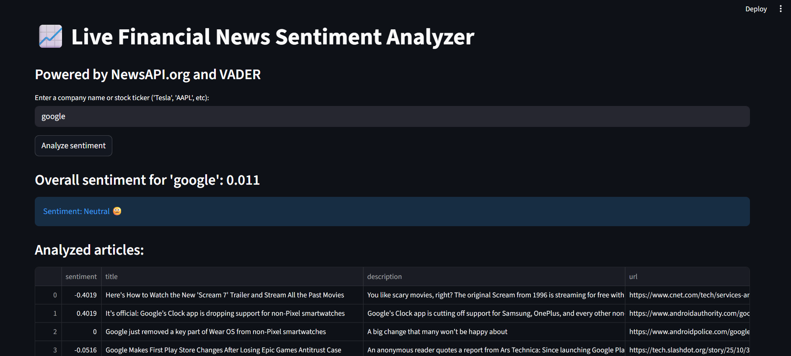

# Live Financial News Sentiment Analyzer

**View the live app:** [**Click here!**](https://sentiment-analyzer-44jsyh8kctwu7pdysw2vu8.streamlit.app/)

This is an end to end AI project that scrapes live financial news headlines and analyzes their sentiment in real-time.




### The goal

The goal of this project was to build an end to end AI product for daily news market sentiment.

### Tech stack

* **Language:** Python
* **Data collection:** NewsAPI.org
* **AI / Modeling:** vaderSentiment
* **Web app:** Streamlit
* **Deployment:** Streamlit community cloud
* **Utilities:** pandas, python-dotenv


### How it works

1.  **Data collection:** The user enters a topic.
2.  **API call:** The app makes a GET request to NewsAPI.org to fetch the top 50 recent headlines for that topic.
3.  **Modeling (NLP):** Each headline's title is passed through the VADER sentiment analyzer, which returns a compound score (from -1.0 for very negative to +1.0 for very positive).
4.  **Analysis:** The app calculates the average compound score of all 50 headlines to get a general sentiment for the topic.
5.  **Deployment (UI):** The results, average score, and a pandas DataFrame of the articles are all displayed in an easy-to-use Streamlit web interface.


### How to run this project locally

1.  **Clone the repository:**
    ```bash
    git clone https://github.com/MarcusHanmer1/Sentiment-Analyzer
    cd Sentiment-Analyzer
    ```

2.  **Create and activate a virtual environment:**
    ```bash
    python -m venv venv
    source venv/Scripts/activate or venv/bin/activate (depending on os)
    ```

3.  **Install the dependencies:**
    ```bash
    pip install -r requirements.txt
    ```

4.  **Create your `.env` file:**
    * Create a file named `.env` in the main folder.
    * Get a free API key from [NewsAPI.org](https://newsapi.org/).
    * Add your key to the file like this: `news_api_key = your actual key!`

5.  **Run the streamlit app:**
    ```bash
    streamlit run app.py
    ```
    Your app will open in your browser
